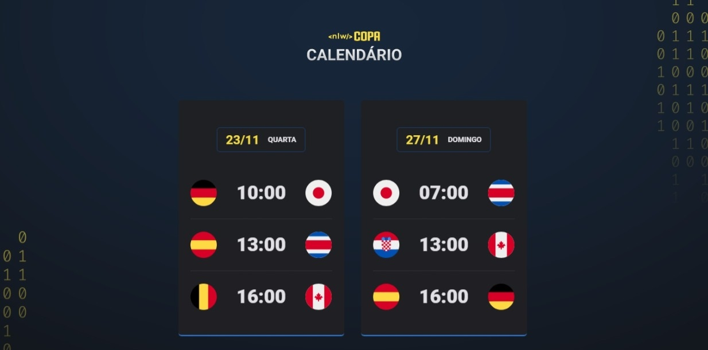

<h1 align="center"> NLW #10 Copa Explorer </h1>

    Projeto desenvolvido durante a 10ª edição da Next Level Week promovida pela Rocketseat.

  <a href="#-tecnologias">Tecnologias</a>&nbsp;&nbsp;&nbsp;|&nbsp;&nbsp;&nbsp;
  <a href="#-projeto">Projeto</a>&nbsp;&nbsp;&nbsp;|&nbsp;&nbsp;&nbsp;
  <a href="#memo-licença">Licença</a>

  

 

  

 

## 🚀 Tecnologias

Esse projeto foi desenvolvido com as seguintes tecnologias:

- HTML e CSS
- JavaScript
- Git e Github

## 💻 Projeto

O Calendário da Copa é um projeto que mostra os jogos da Copa 2022.

Você pode visualizar o projeto através [DESSE LINK](https://paula-passari.github.io/nlw_copa_explorer/).

## :memo: Licença

Esse projeto está sob a licença MIT.
